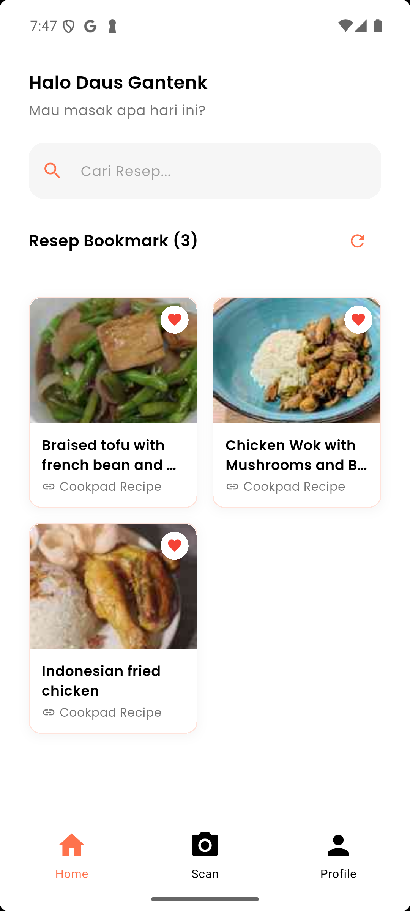
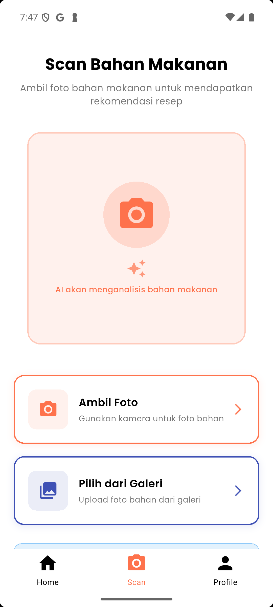
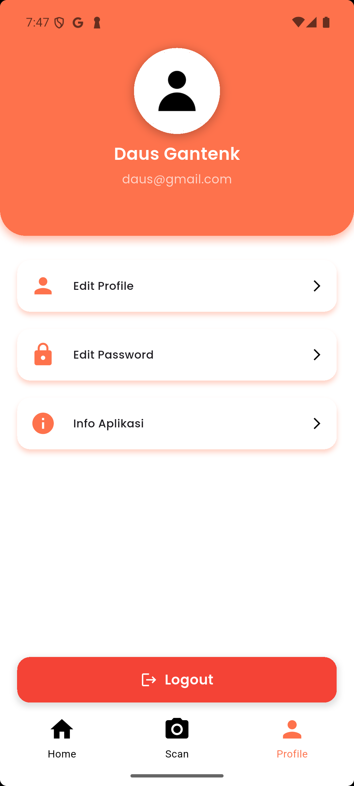
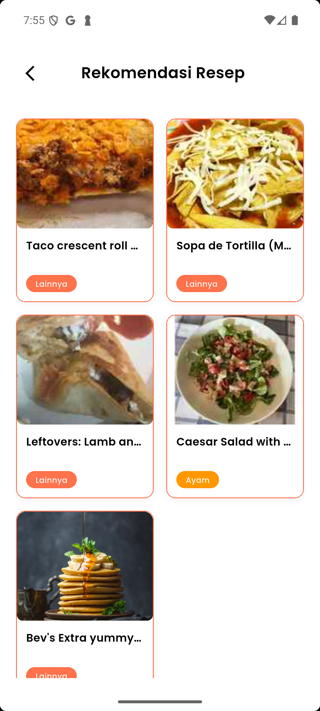

# 🍳 Resepin - Recipe App for Home Ingredients

[](https://flutter.dev)
[](https://dart.dev)
[](https://developer.android.com)

**Resepin** adalah aplikasi resep makanan yang didukung oleh artificial intelligence (AI). Dapatkan resep berdasarkan bahan-bahan yang tersedia di rumah tanpa perlu repot mencari secara manual. Ubah gaya hidup Anda menjadi lebih mudah dan lezat dengan Resepin.

> ⚠️ **Disclaimer**: AI dapat menghasilkan data yang tidak akurat, jadi pastikan untuk memeriksa kembali resep yang dihasilkan.

## 📱 Download APK

**[📥 Download Resepin APK](https://drive.google.com/file/d/1FxfW5dY-lNt-W5NpOZzqJ_BhlVL0Qj5Z/view?usp=sharing)**

## ✨ Fitur Utama

### 🔍 **AI-Powered Recipe Recommendation**
- Upload foto bahan makanan yang Anda miliki
- AI akan mengenali bahan dan memberikan rekomendasi resep
- Teknologi machine learning untuk prediksi resep yang akurat

### 📖 **Recipe Management**
- Lihat detail resep lengkap dengan bahan dan cara memasak
- Bookmark resep favorit untuk akses cepat
- Search dan filter resep berdasarkan nama atau bahan

### 👤 **User Authentication**
- Register dan login dengan email
- Profil pengguna yang dapat diedit
- Sinkronisasi bookmark antar device

### 🔎 **Smart Search**
- Pencarian real-time di bookmark
- Filter berdasarkan nama resep atau bahan
- Hasil pencarian yang relevan dan cepat

## 🛠️ Tech Stack

- **Frontend**: Flutter (Dart)
- **State Management**: GetX
- **HTTP Client**: http package
- **UI Components**: Google Fonts, Custom Widgets
- **Image Processing**: AI-powered ingredient recognition
- **Backend API**: Laravel REST API

## 📸 Screenshots

| Home Page | Recipe Detail | Camera Upload | Profile |
|-----------|---------------|---------------|---------|
|  |  |  |  |

## 🏗️ Project Structure

```
lib/
├── api/                    # API configurations
├── controllers/            # GetX controllers
│   ├── auth/              # Authentication controllers
│   ├── bookmark_controller.dart
│   └── recipe_controller.dart
├── models/                # Data models
├── pages/                 # UI pages
│   ├── auth/              # Login & Register pages
│   ├── profile/           # Profile related pages
│   ├── home_page.dart
│   └── detail_resep_page.dart
├── services/              # API services
├── theme/                 # App theme & colors
├── widgets/               # Reusable widgets
└── main.dart              # App entry point
```

## 🔧 Configuration

### API Endpoints

The app connects to the following API endpoints:

```dart
// Authentication
POST /login
POST /register
GET  /user
POST /logout

// Recipe Management
POST /recipe/recommend     # AI recipe recommendation
POST /recipe/predict       # Ingredient prediction
GET  /recipe/bookmark/detail/{id}

// Bookmark Management
POST /recipe/bookmark/add
POST /recipe/bookmark/remove
GET  /recipe/bookmark/list
```

## 👥 Team

- **AI Engineer**: Seno Aji
- **Mobile Developer**: Muhammad Firdaus Chuzaeni  
- **Backend Developer**: Daffa Ahmad Saifullah Mubaroki

## 📞 Contact & Support

- **GitHub Issues**: [Create an issue](https://github.com/username/resepin/issues)

## 🔄 Version History

### v1.0.0 (Juli 2025)
- ✅ Initial release
- ✅ AI-powered recipe recommendation
- ✅ User authentication system
- ✅ Bookmark functionality
- ✅ Recipe search and filtering
- ✅ Responsive UI design

---

**Made with ❤️ by Team Resepin**

[](https://drive.google.com/file/d/1FxfW5dY-lNt-W5NpOZzqJ_BhlVL0Qj5Z/view?usp=sharing)
